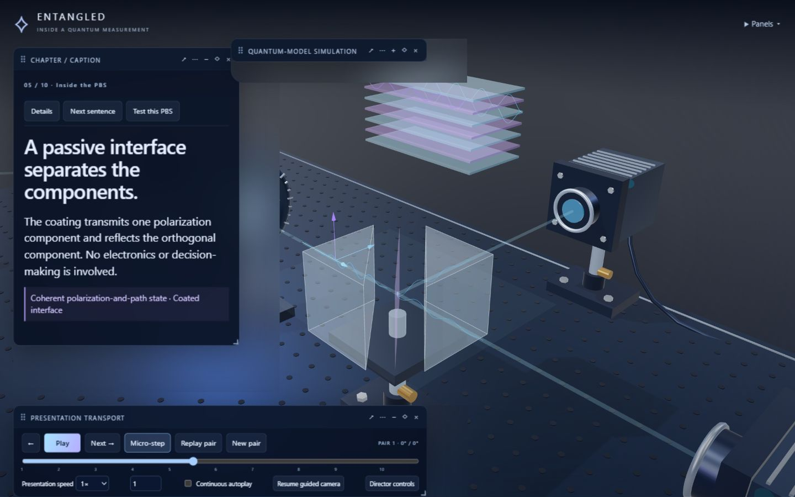
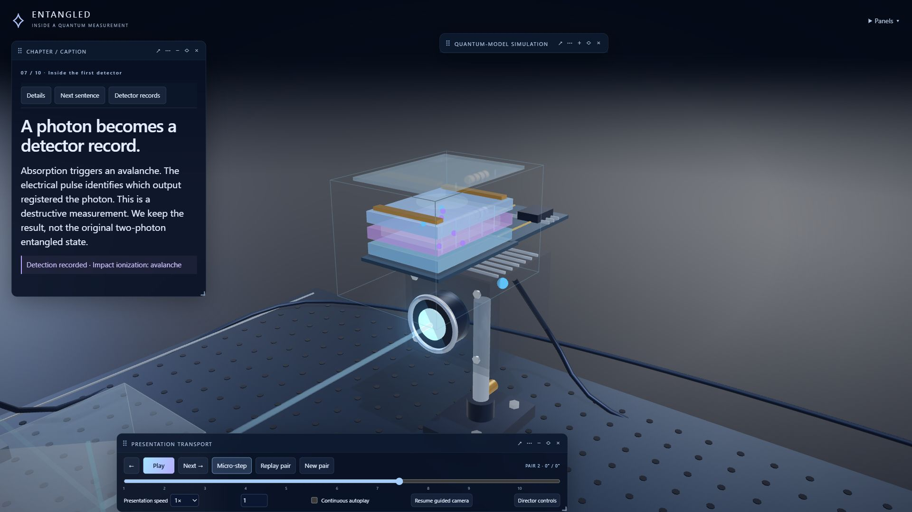

# ENTANGLED
### Inside a Quantum Measurement

An interactive quantum-optics laboratory by [DevMajed](https://github.com/DevMajed).

Follow one entangled photon pair from its source, through two measurement stations, and into the detector records that build a statistical pattern. Pause the experiment, orbit the hardware, look inside the optical components, and present the explanation at your own pace.



## What is happening?

The source prepares two photons in one shared quantum state. One travels to Alice's station and the other to Bob's. Neither photon starts with a secretly assigned H/V polarization label.

Each station contains a **half-wave plate**, a **polarizing beam splitter (PBS)** and **two single-photon avalanche detectors (SPADs)**. The wave plate sets the measurement basis. The PBS coherently routes polarization components into different output paths. Absorption inside a detector produces carriers, an avalanche, an electrical pulse and finally a timestamp.

Each ideal pair produces exactly one detector event on each arm. The original photons are consumed by detection; their records remain. Repeating the experiment with fresh pairs reveals correlations that are difficult to see in a single random-looking event.

The central distinction is between **coherent optical routing** and **recorded detection**. A passive PBS is not an electronic decision-maker, and its two output branches are amplitudes for one photon, not two copies.

## Explore the experiment

- **Follow one pair:** a guided ten-chapter journey through the complete apparatus.
- **Look inside:** exploded PBS prisms and a coating schematic; a SPAD semiconductor cutaway with absorption, carrier acceleration, avalanche, pulse and quenching.
- **Direct the presentation:** pause, micro-step, seek the timeline, replay the same pair, loop a chapter, change speed or choose continuous autoplay.
- **Take over the camera:** orbit, pan and zoom; manual movement releases choreography until you resume it. Camera bookmarks and a second-arm inset help with explanations.
- **Arrange your screen:** drag, resize, dock, collapse, lock or hide every explanation/control panel. Layouts and edited captions survive reloads.
- **Collect results:** sample 100, 1,000, 10,000 or 100,000 fresh pairs, compare separate basis/source runs and inspect an actual sampled pair from a batch.



## Try the correlation reveal

Start with the entangled singlet, then compare these settings in separate fresh runs:

| Alice / Bob basis | Expected singlet pattern | Expected correlation E |
| --- | --- | ---: |
| 0° / 0° | Opposite outcomes every time; each local result remains random | −1 |
| 45° / 45° | Opposite outcomes again, in the rotated basis | −1 |
| 0° / 45° | All four joint outcomes equally likely | 0 |

Now select the ordinary H/V–V/H mixture and repeat 45° / 45°. Its perfect H/V anticorrelation disappears in the diagonal basis. This comparison shows why one matching-basis run alone does not establish entanglement. The application is a quantum-model simulation, not a claim of experimental proof.

The measured bars come from sampled records. Calculated theory is displayed separately. Changing a basis creates a separate count group and never rewrites earlier outcomes.

## Run locally

Install a supported Node.js LTS release (Node 20.19+ or 22.12+) and npm, then:

```sh
git clone https://github.com/DevMajed/ENTANGLED.git
cd ENTANGLED
npm ci
npm run dev
```

Open **http://127.0.0.1:5173/**. On Windows PowerShell, use `npm.cmd` if your execution policy prevents `npm` from running.

To build and preview the production version:

```sh
npm run build
npm run preview
```

Open **http://127.0.0.1:4173/**. Run the automated tests with `npm test`. A modern browser with WebGL support is required.

## Presentation controls

Press **Follow one pair** to begin. The default guided sequence pauses at teaching moments until you press **Next**. **Continuous autoplay** removes those waits. **Micro-step** advances individual PBS, detector and timing events; the numbered timeline markers select chapters, and the slider seeks within the same pair.

**Replay pair** uses the existing event and adds no counts. **New pair** creates a fresh observation. Presentation speed changes the explanation's pace, while simulated source rate and nanosecond event timestamps remain separate.

Drag the canvas to orbit, right-drag to pan and scroll to zoom. Use **Resume guided camera** when you want the choreography back. **Panels ▾** restores hidden panels. Drag panel headers, resize their edges/corners and use the ⋯ menu for docking, text scale, spacing and opacity.

**Director controls** lets you edit each chapter's captions, reveal or hide text, adjust holds, keep physics running under a held caption, change camera transition duration and show recording-safe margins. **Reset experiment** clears observations; **Reset layout** restores panel placement.

| Key | Action |
| --- | --- |
| Space | Play / pause |
| ← / → | Previous / next chapter |
| H | Hide / restore all overlays |
| Escape | Leave the PBS component inspector or return to the overview |

Shortcuts do not interrupt typing. A focused button retains its normal Space activation.

## What was used to build it?

| Part | Technology / approach |
| --- | --- |
| Interactive laboratory | Three.js and WebGL, with procedural meshes, materials, lighting, optical paths and cutaways |
| Interface | Vanilla JavaScript modules, HTML and CSS |
| Development / production build | Vite |
| Quantum model | Independent JavaScript probability and complex-state calculations |
| Large batches | A Web Worker, with results committed in chunks between animation frames |
| Playback | A deterministic timeline applied to immutable measurement records |
| Saved layouts and captions | Browser local storage |
| Tests | Node.js's built-in test runner |

The scene is rendered live; it is not a prerecorded video. The physics does not depend on camera position, rendering speed or panel placement. The application runs locally without a backend service or runtime API calls.

For the equations, event pipeline and file map, read [How it works](docs/HOW_IT_WORKS.md). For executed checks and their limits, read [Validation](docs/VALIDATION.md).

## Model boundaries

This is an educational model of a successfully prepared pair, ideal lossless optics and perfect single-photon detection. Wavepackets, coating fields and avalanche carriers are explanatory drawings. The program does not numerically solve a real crystal, dielectric coating or semiconductor device.

Timestamp matching uses detector channels and a calibrated full-width coincidence window, not simulator pair IDs. Optional timestamp jitter is explicitly simulated and does not change polarization probabilities. Large batches compute every requested pair while keeping representative visuals and the visible log bounded.
